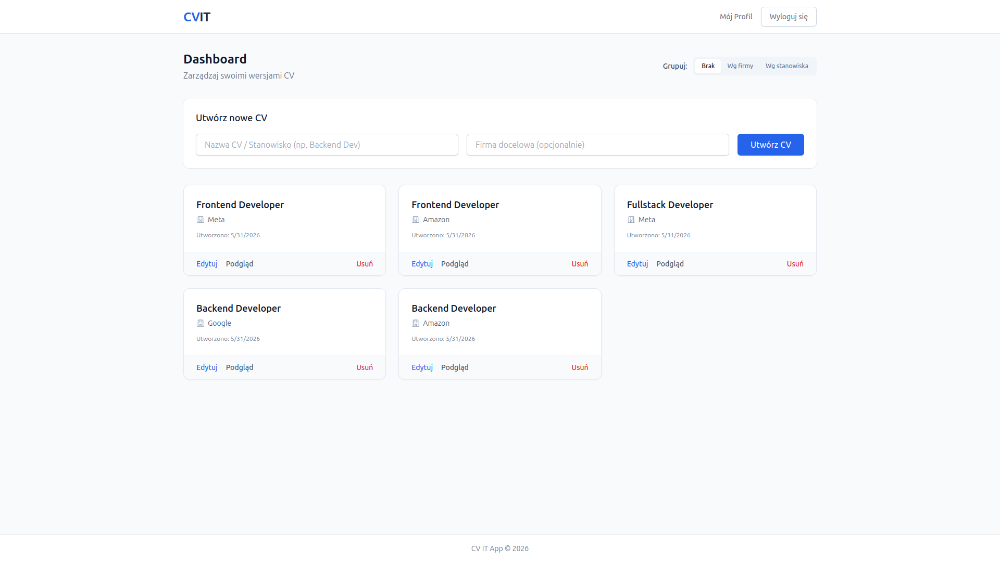
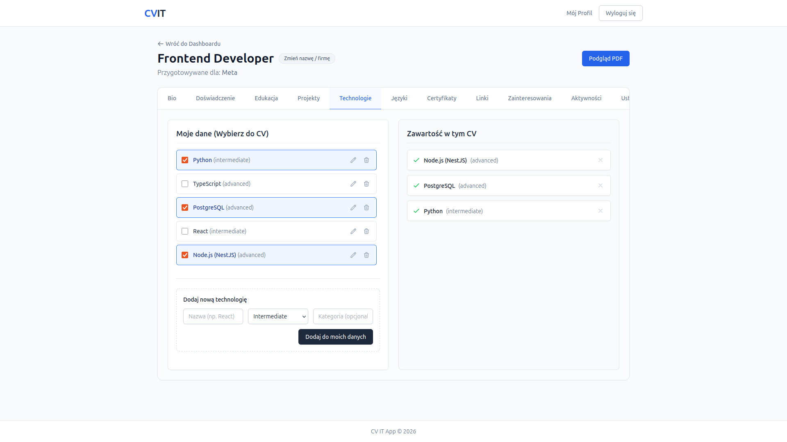
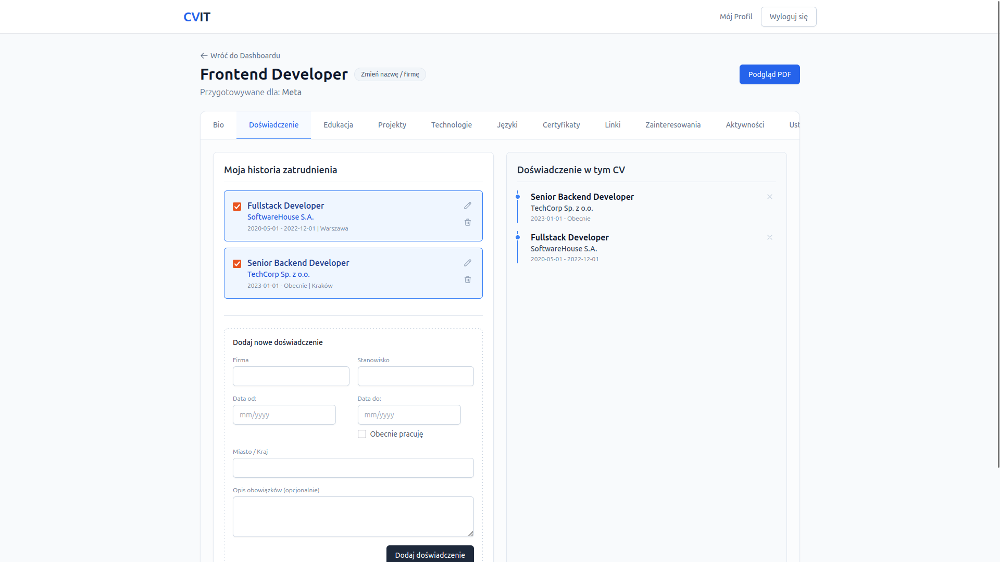
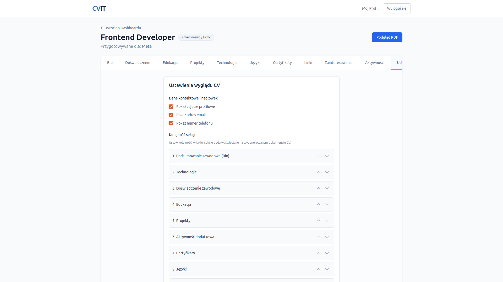
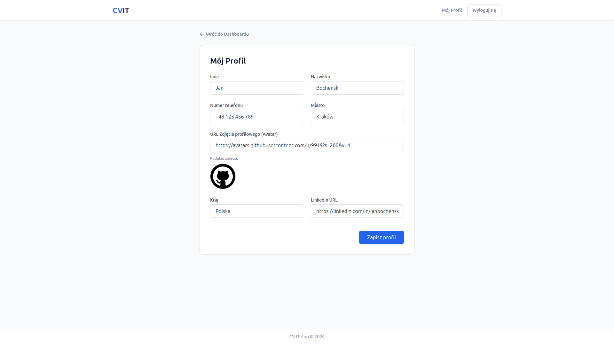
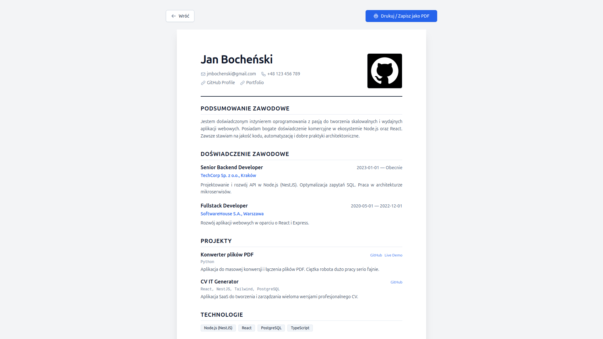
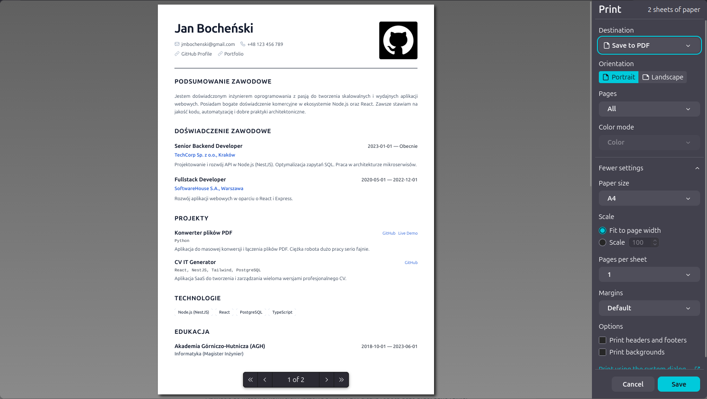

# Sprawozdanie z Projektu: CViT (CV Generator)

**Data:** 1 czerwca 2026 r.  
**Autor:** Jan Bocheński

---

## 1. Wstęp i Cel Projektu

Projekt **CViT** to zaawansowany generator dokumentów Curriculum Vitae (CV) w formie aplikacji webowej. Głównym celem było stworzenie narzędzia, które pozwala użytkownikowi na zarządzanie "bazą danych" swoich osiągnięć (doświadczenia, projektów, umiejętności) i elastyczne składanie z nich wielu wersji dokumentów dopasowanych pod konkretne oferty pracy.

## 2. Stos Technologiczny

Aplikacja została oparta na nowoczesnym stacku **Fullstack TypeScript**:

- **Backend:** NestJS (Node.js), TypeORM, PostgreSQL.
- **Frontend:** React.js, Vite, TailwindCSS, Headless UI.
- **Zarządzanie stanem i API:** @tanstack/react-query (pobieranie danych, cache'owanie, optimistic updates).
- **Inne:** Docker (konteneryzacja bazy i aplikacji), JWT (autoryzacja).

## 3. Przegląd Funkcjonalności

### 3.1. Dashboard i Zarządzanie Dokumentami

Dashboard pozwala na błyskawiczny przegląd wszystkich stworzonych wersji CV. Zaimplementowano funkcję grupowania dokumentów według:

- **Firmy docelowej** (ułatwia zarządzanie procesami rekrutacyjnymi),
- **Stanowiska/Nazwy** (grupowanie podobnych wariantów kompetencyjnych).

_Rysunek 1: Widok główny z opcjami grupowania i szybkiego tworzenia dokumentu._

### 3.2. Edytor Modułowy (Sekcje)

Edytor podzielony jest na logiczne zakładki odpowiadające elementom składowym CV. Użytkownik najpierw zarządza swoją bazą (np. dodaje wszystkie projekty), a następnie za pomocą checkboxów decyduje, które z nich mają pojawić się w aktualnie edytowanym dokumencie.

**Zaimplementowane sekcje:**

- **Bio / Podsumowanie:** Krótki opis sylwetki zawodowej.
- **Doświadczenie:** Historia zatrudnienia z obsługą stanowisk archiwalnych i trwających.
- **Projekty:** Portfolio z linkami do GitHub/Live Demo.
- **Technologie:** Skategoryzowane umiejętności z poziomem zaawansowania.
- **Certyfikaty, Języki, Linki, Zainteresowania i Aktywności dodatkowe.**

_Rysunek 2: Interfejs wyboru i dodawania technologii do CV._

_Rysunek 3: Formularz edycji doświadczenia zawodowego._

### 3.3. Personalizacja i Ustawienia (Layout)

Zgodnie z wymaganiami, użytkownik ma pełną kontrolę nad tym, jak dokument wygląda. W zakładce **"Ustawienia"** zaimplementowano mechanizm **Drag & Drop (Move Up/Down)**, który pozwala zmieniać kolejność sekcji na gotowym wydruku. Dodatkowo można ukrywać/pokazywać zdjęcie, e-mail czy numer telefonu.

_Rysunek 4: Panel konfiguracji kolejności wyświetlania modułów w PDF._

### 3.4. Profil Użytkownika

Dane osobowe są scentralizowane w zakładce "Mój Profil". Raz wprowadzone imię, nazwisko czy zdjęcie profilowe (Avatar) są automatycznie propagowane do wszystkich wersji dokumentów.

_Rysunek 5: Centralny panel zarządzania danymi osobowymi._

### 3.5. Podgląd i Generowanie PDF

Dokument renderowany jest dynamicznie na podstawie bazy danych. Zastosowano style CSS dedykowane dla mediów drukowanych (`@media print`), co pozwala na czysty eksport do pliku PDF w formacie A4 bezpośrednio z poziomu przeglądarki.

_Rysunek 6: Renderowanie końcowego dokumentu CV._

_Rysunek 7: Systemowe okno drukowania/zapisu do PDF._

---

## 4. Wyzwania Techniczne i Rozwiązania

Podczas prac nad projektem rozwiązano szereg problemów inżynierskich:

1. **Deduplikacja i Agregacja API:** Aby uniknąć "floodingu" zapytaniami podczas ładowania 10 zakładek edytora, wdrożono endpoint `/data/aggregated` i mechanizm cache'owania po stronie frontendu.
2. **Optimistic Saving:** Zaimplementowano natychmiastowe aktualizowanie UI po kliknięciu checkboxa, zanim serwer potwierdzi zapis. Poprawia to płynność pracy (brak "zacięć").
3. **Circular Dependency:** Rozwiązano błąd krążących zależności między encjami `User` i `Profile` poprzez zastosowanie typu referencyjnego string w TypeORM.
4. **Walidacja Dat:** Wdrożono transformatory DTO, które mapują formaty `YYYY-MM` (używane przez wygodne kalendarze na frontendzie) na pełne daty akceptowane przez PostgreSQL.

## 5. Podsumowanie i Perspektywy Rozwoju

Aplikacja CViT jest kompletnym narzędziem spełniającym założenia projektowe, zapewniającym wysoką wydajność, spójność danych oraz intuicyjny interfejs użytkownika. Zastosowana architektura została zaprojektowana z myślą o dużej skalowalności, szczególnie w kontekście wdrażania rozwiązań opartych na sztucznej inteligencji (AI) oraz integracji z profesjonalnymi systemami rekrutacyjnymi (ATS).

### Możliwe kierunki dalszego rozwoju:
- **Inteligentny Import:** Wykorzystanie modeli NLP do analizy starych plików CV (PDF/Word) i automatycznego wyodrębniania z nich danych w celu tworzenia gotowych "kafelków" doświadczenia i edukacji w bazie użytkownika.
- **AI CV Optimizer:** Funkcja pozwalająca na wklejenie linku do konkretnej oferty pracy. System, korzystając z bazy danych użytkownika oraz modeli AI, mógłby automatycznie wygenerować optymalną wersję CV, dopasowując słowa kluczowe i priorytetyzując sekcje pod kątem wymagań danej oferty.
- **Integracje HR i Modelowanie Grafowe:** Możliwość połączenia z dużymi systemami kadrowymi. Wykorzystanie grafowych modeli danych (np. baz typu Neo4j) mogłoby pozwolić na zaawansowane wyszukiwanie pracowników i ofert pracy poprzez analizę powiązań między unikalnymi zestawami kompetencji użytkowników a realnym rynkiem pracy.

Projekt stanowi solidny fundament pod nowoczesne narzędzie typu "Personal Career Manager".
